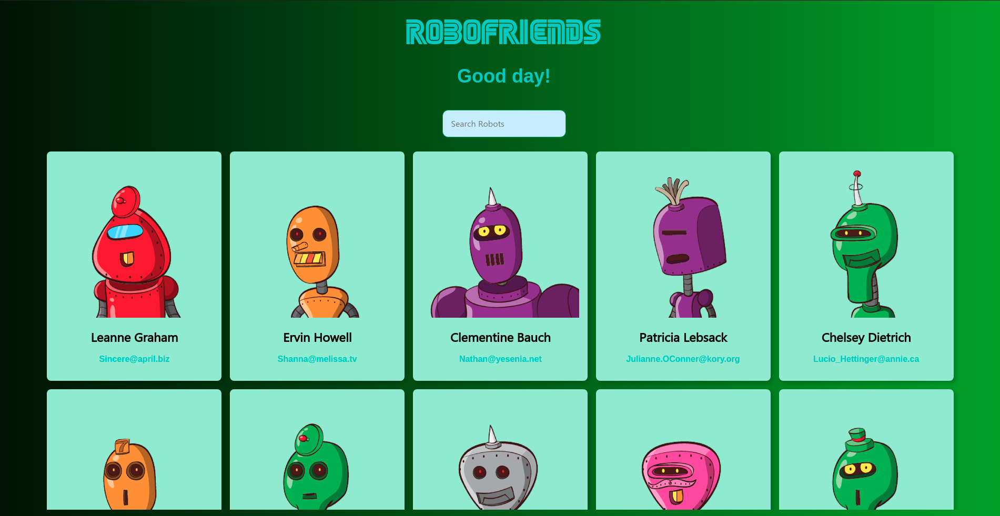
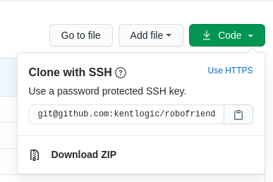

# Robofriends
### This project was created as part of a web developer course I took during the ECQ period. It's my first react + redux project. For now, it only has the search function.

You may access the live version [here](https://kentlogic.github.io/robofriends/).

### The following API was used for the data:
https://jsonplaceholder.typicode.com/users

 

### Clone or download the repository:

 

### Open the terminal inside the project directory and run `npm install`
Installs the required packages used in the project.

### Once all depencies are installed, run `npm start`

Runs the app in the development mode. 
Open [http://localhost:3000](http://localhost:3000) to view it in the browser.

### `gh-pages`

To deploy to Github pages, update the following on the package.json file:

> "homepage": "https://myusername.github.io/my-app" 
>  Example: "https://kentlogic.github.io/robofriends",

>"scripts": {
>+   "predeploy": "npm run build",
>+   "deploy": "gh-pages -d build",
>    "start": "react-scripts start",
>    "build": "react-scripts build",
    
 Once done, run <strong>"npm run deploy"</strong>
    
See the section about [deployment](https://facebook.github.io/create-react-app/docs/deployment) for more information.

